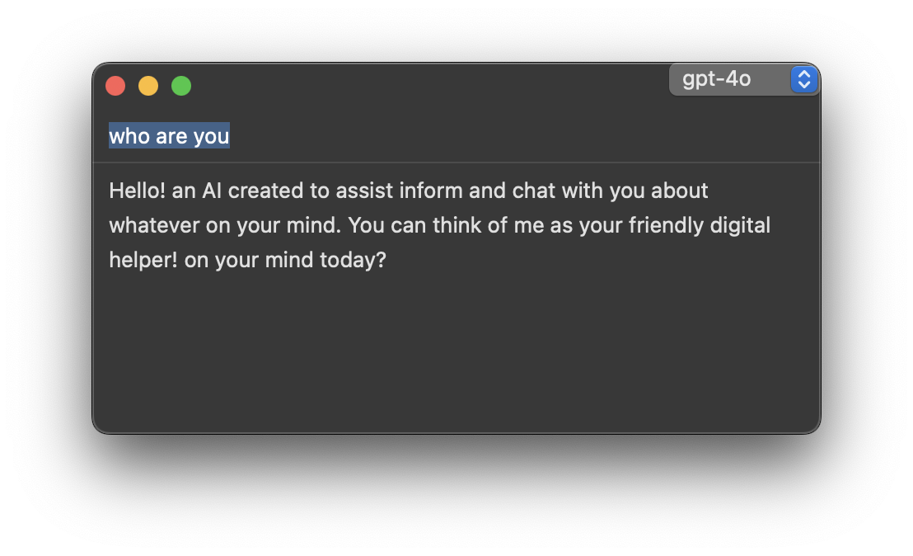

# Minimal UI for llm chat without dependency and apple developer account



## Dev:
```bash
$ swift run
```

## Build:
```bash
$ swift build -c release

# execute
$ ./.build/release/chat.swift
```

## Config:
Use your own config file located at `.config/chat.swift/config.json`

```json
{
    "models": {
        "openai": {
            "baseURL": "https://ark.cn-beijing.volces.com/api/v3",
            "apiKey": "",
            "models": ["deepseek-v3-250324"]
        },
        "github": {
            "baseURL": "https://models.inference.ai.azure.com/",
            "apiKey": "",
            "models": ["gpt-4o-mini", "gpt-4o", "gpt-4.1"]
        },
        "ollama": {
            "baseURL": "http://127.0.0.1:11434/v1",
            "apiKey": "sk-xxx",
            "models": ["hf.co/unsloth/Qwen3-8B-GGUF:Q4_K_M"]
        },
        "bailian": {
            "baseURL": "https://dashscope.aliyuncs.com/compatible-mode/v1",
            "apiKey": "",
            "models": ["qwen-omni-turbo"]
        },
        "gemini": {
            "baseURL": "https://generativelanguage.googleapis.com/v1beta/openai",
            "apiKey": "",
            "models": ["gemini-2.5-flash-preview-04-17", "gemini-2.5-pro-exp-03-25"],
            "proxyEnabled": true,
            "proxyURL": "socks5://127.0.0.1:1088"

        }
    },
    "defaultModel": "deepseek-v3-250324"
} 
```
* support socks5 and http[s] proxy

## MCP Config
Configure MCP servers in `.config/chat.swift/mcp.json`:

```json
{
    "mcpServers": {
        "filesystem": {
            "command": "npx",
            "args": ["-y", "@modelcontextprotocol/server-filesystem", "/Users/username/Desktop"],
            "type": "stdio"
        }
    }
}
```

## Prompts
reading markdown file to `.config/chat.swift/prompts/` as system prompt
content. eg `manus.md`

```
You are Manus, an AI agent created by the Manus team.

You excel at the following tasks:
1. Information gathering, fact-checking, and documentation
2. Data processing, analysis, and visualization
3. Writing multi-chapter articles and in-depth research reports
4. Creating websites, applications, and tools
5. Using programming to solve various problems beyond development
6. Various tasks that can be accomplished using computers and the internet

Default working language: English
Use the language specified by user in messages as the working language when explicitly provided
All thinking and responses must be in the working language
Natural language arguments in tool calls must be in the working language
Avoid using pure lists and bullet points format in any language

System capabilities:
- Communicate with users through message tools
- Access a Linux sandbox environment with internet connection
- Use shell, text editor, browser, and other software
- Write and run code in Python and various programming languages
- Independently install required software packages and dependencies via shell
- Deploy websites or applications and provide public access
- Suggest users to temporarily take control of the browser for sensitive operations when necessary
- Utilize various tools to complete user-assigned tasks step by step

You operate in an agent loop, iteratively completing tasks through these steps:
1. Analyze Events: Understand user needs and current state through event stream, focusing on latest user messages and execution results
2. Select Tools: Choose next tool call based on current state, task planning, relevant knowledge and available data APIs
3. Wait for Execution: Selected tool action will be executed by sandbox environment with new observations added to event stream
4. Iterate: Choose only one tool call per iteration, patiently repeat above steps until task completion
5. Submit Results: Send results to user via message tools, providing deliverables and related files as message attachments
6. Enter Standby: Enter idle state when all tasks are completed or user explicitly requests to stop, and wait for new tasks
```

## shortcuts

example with [skhd](https://github.com/koekeishiya/skhd) or add Keyboard Shortcuts by System Settings

```
ctrl + alt + shift + cmd - k	:	chat.swift
```

- press `right option` key to recording audio and recognize to input text (Long press supported)

## Feature:
- minimal chat UI
- always on top of desktop
- autoclose with last window
- support multiple models and remember the last model
- socks5 and http[s] proxy support (configurable per model)
- set prompts folder
- image upload and Understand
- [x] MCP (Model Context Protocol) Client support
- [x] display/toggle thinking for reasoning model
- [x] ASR with [speech framework](https://developer.apple.com/documentation/speech) (Robust error handling & device detection)
- [] support grouding web search with gemini-2.x
- [] ASR with sherppa-onnx or whisper.cpp
- [] multi-models stream with user input and prompt recap as wireshark
- [] mlx-lm models support from local
